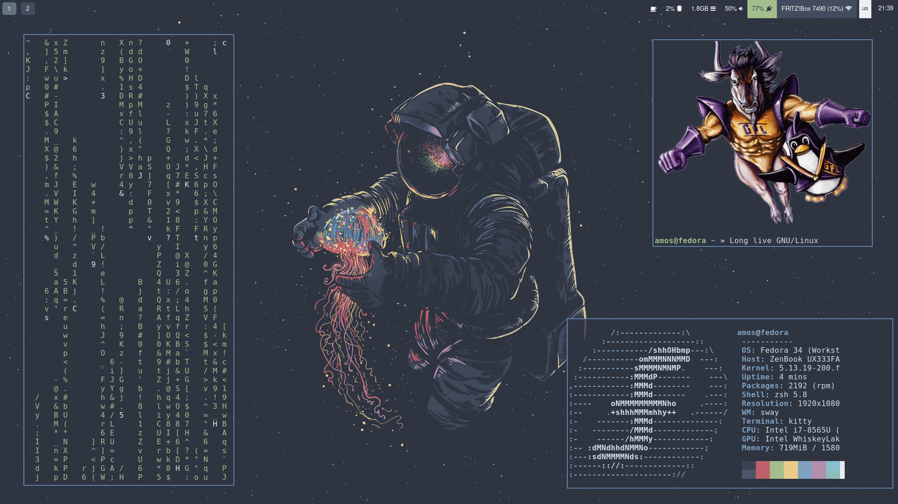

# .dotfiles

## Description
All Dotfiles, that I currently use to power my configs. This repo aims to improve sharing of it and usage across multiple systems.



## Provides Configs for
- zsh
- bash
- ranger
- sway
- tmux
- neovim

## Setup
Install Ansible:
```bash
python3 -m pip install --user ansible
```

Runs Ansible Setup:
```bash
ansible-playboot bootstrap.yaml --ask-become-pass
```
